# National Institute of Standards and Technology (NIST) Special Publication 1500-100, Election Results Reporting Common Data Format Specification Revision 2.0

**March 2020**

**The following is an excerpt from the SP 1500-100 specification. It contains the specification's executive summary and class documentation.**

The complete publication including JSON and XML schemas is available free of charge from:

<https://github.com/usnistgov/ElectionResultsReporting>

# Executive Summary

This publication presents a common data format (CDF) for pre-election
setup information and post-election results reporting. The format, known
as the Election Results Common Data Format Specification Version 2.0, is
comprehensive and detailed in its coverage of election results-related
data and at the same time very flexible, able to accommodate election
scenarios used throughout the United States. This publication describes:

  - a UML (Unified Modeling Language) model,

  - derived XML (eXtensible Markup Language) and JSON (JavaScript Object
    Notation) schemas,

  - usage information and guidance, and

  - background information.

This specification provides a common data interchange format for
election data used in voting systems across U.S. jurisdictions. Using
this specification, pre-election and post-election data can be published
in a common, well-understood format. The format accommodates highly
detailed election results data and is sufficiently flexible to
accommodate many different types of contests and political structures.

This specification provides manufacturers of election management systems
(EMS) and managers of election jurisdictions with standard methods for
importing and exporting election data, thereby increasing
interoperability among election devices and reducing the need to create
software to translate between proprietary formats. Interoperable data
will reduce costs to election jurisdictions by reducing the complexity
in election management and offering jurisdictions more choice in
election equipment.

This specification is geared towards the following audiences:

  - Election officials

  - Voting equipment manufacturers

  - Election-affiliated organizations and

  - Election analysts and the general public

The format accommodates three different election scenarios:

**Pre-election**. The period prior to an election, for reporting
pre-election data from a jurisdiction but not yet complete information
about any election.

**Election**. The period during which an election is being conducted and
election results reports are produced. The reports include aggregated
results data or more detailed, precinct-level reporting, depending on
the capabilities of the reporting jurisdiction.

**Post-election**. The period after the polls close when more detailed
election results reports are produced with options for precinct
reporting, type of ballot, and type of device.

The XML and JSON schemas associated with this specification are derived
from the UML model, which defines the types, structure, and
interrelationships of geopolitical geography across the United States.
The model was designed to accommodate multiple types of contests and
their many variations. It also provides the capability to report on
these contests from higher aggregate levels down to very fine levels of
detail, including:

  - reporting by precincts and split precincts;

  - reporting by ballot type, for example, absentee and election day;
    and

  - reporting by device type and specific voting device.

The UML model can be re-used and modified to meet the needs of other
planned common data format specifications for voting devices such as
electronic pollbooks and ballot marking devices.

# Notice of Revision 2.0

This document is a version 2.0 revision to the NIST Special Publication
1500-100, Election Results Common Data Format Specification, Version 1.
Changes were made to the version 1 UML model to add additional
information and make the model easier to implement and use.
Additionally, the XML schema was updated accordingly and a new JSON
schema was generated.

# Table of Contents
  - Enumerations
    - *The **[BallotMeasureType](#17_0_2_4_f71035d_1426549604222_56408_2487)** Enumeration*
    - *The **[CandidatePostElectionStatus](#17_0_2_4_78e0236_1389797791548_146399_4136)** Enumeration*
    - *The **[CandidatePreElectionStatus](#17_0_2_4_f71035d_1427223542780_950918_2213)** Enumeration*
    - *The **[CountItemStatus](#17_0_2_4_78e0236_1389797161173_369293_4078)** Enumeration*
    - *The **[CountItemType](#17_0_2_4_78e0236_1389798097477_664878_4228)** Enumeration*
    - *The **[DayType](#18_0_2_6340208_1425647845906_917814_4818)** Enumeration*
    - *The **[DeviceType](#17_0_2_4_78e0236_1389798087342_91702_4210)** Enumeration*
    - *The **[ElectionType](#17_0_2_4_78e0236_1389734457182_720347_3938)** Enumeration*
    - *The **[GeoSpatialFormat](#17_0_2_4_f71035d_1425325534467_889921_2544)** Enumeration*
    - *The **[IdentifierType](#17_0_2_4_f71035d_1425061188508_163854_2613)** Enumeration*
    - *The **[OfficeTermType](#17_0_2_4_f71035d_1425314816880_411605_2504)** Enumeration*
    - *The **[ReportDetailLevel](#17_0_2_4_d420315_1392318380928_311473_2471)** Enumeration*
    - *The **[ReportingUnitType](#17_0_2_4_f71035d_1431607637366_785815_2242)** Enumeration*
    - *The **[ResultsStatus](#17_0_2_4_78e0236_1389734128637_37089_3895)** Enumeration*
    - *The **[VoteVariation](#17_0_2_4_78e0236_1389798224990_11192_4272)** Enumeration*
  - Classes
    - *The **[AnnotatedString](#18_0_2_6340208_1497553224568_429892_4565)** Class*
    - *The **[AnnotatedUri](#18_0_2_6340208_1498658436378_308208_4565)** Class*
    - *The **[BallotCounts](#17_0_2_4_78e0236_1397156576157_466818_2461)** Class*
    - *The **[BallotMeasureContest](#17_0_2_4_78e0236_1389366932057_929676_2783)** Class*
    - *The **[BallotMeasureSelection](#17_0_2_4_78e0236_1389372163799_981952_2926)** Class*
    - *The **[BallotStyle](#17_0_2_4_78e0236_1389366224561_797289_2360)** Class*
    - *The **[Candidate](#17_0_2_4_78e0236_1389366272694_544359_2440)** Class*
    - *The **[CandidateContest](#17_0_2_4_78e0236_1389366970084_183781_2806)** Class*
    - *The **[CandidateSelection](#17_0_2_4_d420315_1392145640524_831493_2562)** Class*
    - *The **[Coalition](#18_0_2_6340208_1425647247631_162984_4712)** Class*
    - *The **[ContactInformation](#17_0_5_1_43401a7_1400624327407_326048_3637)** Class*
    - *The **[Contest](#17_0_2_4_78e0236_1389366251994_876831_2400)** Class*
    - *The **[ContestSelection](#17_0_2_4_78e0236_1389372124445_11077_2906)** Class*
    - *The **[Counts](#17_0_2_4_78e0236_1389367291663_284973_2835)** Class*
    - *The **[CountStatus](#17_0_2_4_f71035d_1430412663878_61362_2269)** Class*
    - *The **[DateTimeWithZone](#18_0_2_6340208_1519999692422_172889_4576)** Class*
    - *The **[DeviceClass](#18_0_2_6340208_1425911626288_420556_4530)** Class*
    - *The **[Election](#17_0_2_4_f71035d_1426101822599_430942_2209)** Class*
    - *The **[ElectionAdministration](#18_0_2_6340208_1441311877439_710008_4433)** Class*
    - *The **[ElectionReport](#17_0_2_4_78e0236_1389366195564_913164_2300)** Class*
    - *The **[ExternalIdentifier](#17_0_2_4_f71035d_1430405712653_451634_2410)** Class*
    - *The **[GpUnit](#17_0_2_4_78e0236_1389366233346_42391_2380)** Class*
    - *The **[Header](#18_5_3_43701b0_1527684342703_968085_6144)** Class*
    - *The **[Hours](#18_0_2_6340208_1427122205989_885563_4602)** Class*
    - *The **[HtmlColorString](#17_0_2_4_f71035d_1428586849773_722256_2252)** Class*
    - *The **[InternationalizedText](#17_0_2_4_f71035d_1428953680097_700602_2220)** Class*
    - *The **[LanguageString](#17_0_2_4_f71035d_1428953680095_709464_2219)** Class*
    - *The **[LatLng](#17_0_2_4_f71035d_1443104838926_393729_2222)** Class*
    - *The **[Office](#17_0_5_1_43401a7_1400623830572_164081_3518)** Class*
    - *The **[OfficeGroup](#17_0_2_4_f71035d_1433183615993_866714_2239)** Class*
    - *The **[OrderedContent](#18_5_3_43701b0_1527684342715_643544_6146)** Class*
    - *The **[OrderedContest](#17_0_3_43401a7_1394476416139_808596_3142)** Class*
    - *The **[OrderedHeader](#18_5_3_43701b0_1527684342714_129907_6145)** Class*
    - *The **[OtherCounts](#18_0_2_6340208_1508176198256_527421_4561)** Class*
    - *The **[Party](#17_0_2_4_78e0236_1389366278128_412819_2460)** Class*
    - *The **[PartyContest](#17_0_2_4_d420315_1393514218965_55008_3144)** Class*
    - *The **[PartyRegistration](#17_0_2_4_78e0236_1394566839296_58362_2826)** Class*
    - *The **[PartySelection](#17_0_2_4_f71035d_1426519980658_594892_2511)** Class*
    - *The **[Person](#17_0_5_1_43401a7_1400623980732_100904_3567)** Class*
    - *The **[ReportingDevice](#17_0_2_4_78e0236_1389798013459_389380_4178)** Class*
    - *The **[ReportingUnit](#17_0_2_4_f71035d_1400606476166_735297_2593)** Class*
    - *The **[RetentionContest](#18_0_2_6340208_1425646217522_163181_4554)** Class*
    - *The **[Schedule](#18_0_2_6340208_1427122121448_198970_4547)** Class*
    - *The **[ShortString](#18_0_2_6340208_1499878618645_537953_4560)** Class*
    - *The **[SpatialDimension](#17_0_2_4_f71035d_1407165065674_39189_2188)** Class*
    - *The **[SpatialExtent](#17_0_2_4_f71035d_1409080246279_778720_2209)** Class*
    - *The **[Term](#17_0_2_4_f71035d_1428489072598_282236_2217)** Class*
    - *The **[TimeWithZone](#18_0_2_6340208_1427385616970_86952_4407)** Class*
    - *The **[VoteCounts](#17_0_2_4_78e0236_1397156604549_15838_2489)** Class*

## Enumerations

### *The **BallotMeasureType** Enumeration*

Enumeration for types of ballot measures in the [BallotMeasureContest](#17_0_2_4_78e0236_1389366932057_929676_2783) element.

Name | Value
---- | -----
`ballot-measure`|For reports that contain only aggregated counts.
`initiative`|For an initiative.
`recall`|For a recall.
`referendum`|For a referendum.
`other`|Used when the type of ballot measure is not included in this enumeration.

### *The **CandidatePostElectionStatus** Enumeration*

Enumeration for various post-election statuses applicable to a candidate in the [Candidate](#17_0_2_4_78e0236_1389366272694_544359_2440) element.

Name | Value
---- | -----
`advanced-to-runoff`|For candidates who have advanced to a runoff.
`defeated`|Used for candidates who were defeated in the election.
`projected-winner`|For a projected contest winner.
`winner`|For the official contest winner or one of “n” contest winners for n-of-m voting.
`withdrawn`|For candidates who have withdrawn from the contest.

### *The **CandidatePreElectionStatus** Enumeration*

Enumeration for various pre-election statuses applicable to a candidate in the [Candidate](#17_0_2_4_78e0236_1389366272694_544359_2440) class.

Name | Value
---- | -----
`filed`|For candidates who have filed with the election authority but not necessarily qualified.
`qualified`|For candidates who are qualified by the election authority to be on the ballot for a contest.
`withdrawn`|For candidates who have withdrawn from the contest.

### *The **CountItemStatus** Enumeration*

Enumeration for various counting-related statuses for types of ballots or write-ins, used in the [CountStatus](#17_0_2_4_f71035d_1430412663878_61362_2269) class.

Name | Value
---- | -----
`completed`|For counts that are complete.
`in-process`|For counts that are in process.
`not-processed`|When the counting has not started or is not underway.
`unknown`|When the status of the counting is unknown.

### *The **CountItemType** Enumeration*

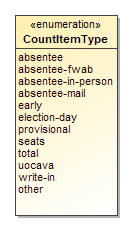

Enumeration for the items that are counted during the course of an election and for which the status of the counts is of interest. Used in the [Counts](#17_0_2_4_78e0236_1389367291663_284973_2835) and [CountStatus](#17_0_2_4_f71035d_1430412663878_61362_2269) classes.

Name | Value
---- | -----
`absentee`|For any/all classes of absentee, generally when absentee is not broken out into specific classes.
`absentee-fwab`|A type of absentee; for Federal Write-in Absentee Ballots.
`absentee-in-person`|A class of absentee; for absentee ballots cast in-person, e.g., at a county office.
`absentee-mail`|A class of absentee; for postal mail absentee ballots separately.
`early`|For ballots cast during early voting periods.
`election-day`|For ballots cast on election day.
`provisional`|For challenged ballots.
`seats`|For legislative balance-of-power results information.
`total`|Total of all ballots cast regardless of voting class.
`uocava`|A class of absentee; for absentee ballots from Uniformed and Overseas Citizens Absentee Voting Act (UOCAVA) voters.
`write-in`|For write-ins on ballots.
`other`|Used when the type of counting item is not included in this enumeration.

### *The **DayType** Enumeration*

Enumeration for the day(s) in a schedule in the [Schedule](#18_0_2_6340208_1427122121448_198970_4547) element.

Name | Value
---- | -----
`all`|Used for all days of the week.
`sunday`|Used if day of week is Sunday.
`monday`|Used if day of week is Monday.
`tuesday`|Used if day of week is Tuesday.
`wednesday`|Used if day of week is Wednesday.
`thursday`|Used if day of week is Thursday.
`friday`|Used if day of week is Friday.
`saturday`|Used if day of week is Saturday.
`weekday`|Used for any day of the week.
`weekend`|Used for both Saturday and Sunday.

### *The **DeviceType** Enumeration*

Enumeration for the type of device in the [DeviceClass](#18_0_2_6340208_1425911626288_420556_4530) class.

Name | Value
---- | -----
`bmd`|For ballots prepared on ballot marking devices and then scanned.
`dre`|For DRE (Direct Record Electronic) and other all-electronic devices.
`manual-count`|For hand-counted paper ballots.
`opscan-central`|For an optical scanner used at a central office with no opportunity for voter correction of mistakes.
`opscan-precinct`|For an optical scanner used at a precinct or other location where voter correction of mistakes such as overvotes is possible.
`unknown`|Used when the type of device is unknown.
`other`|Used when the device type is not listed in this enumeration.

### *The **ElectionType** Enumeration*

Enumeration for the type of election in the [ElectionReport](#17_0_2_4_78e0236_1389366195564_913164_2300) class.

Name | Value
---- | -----
`general`|Election in which all eligible voters, regardless of party affiliation, are permitted to select candidates to fill public office and/or vote on ballot measures.
`partisan-primary-closed`|Primary election in which the voter receives a ballot containing only those party-specific contests pertaining to the political party with which the voter is affiliated, along with non-party-specific contests presented at the same election. Unaffiliated voters may be permitted to vote only on non-party-specific contests.
`partisan-primary-open`|Primary election in which the voter may choose a political party at the time of voting and vote in party-specific contests associated with that party, along with non-party-specific contests presented at the same election. Some states require voters to publicly declare their choice of party at the polling place, after which the election worker provides or activates the appropriate ballot. Other states allow the voters to make their choice of party within the privacy of the voting booth.
`primary`|Election held to determine which candidates qualify to appear as contest options in subsequent elections.
`runoff`|Election to select a winner following a primary or a general election, in which no candidate in the contest received the required minimum percentage of the votes cast. The two candidates receiving the most votes for the contest in question proceed to a runoff election.
`special`|Primary or general election that is not regularly scheduled. A special election may be combined with a scheduled election.
`other`|Used when the election type is not listed in this enumeration.

### *The **GeoSpatialFormat** Enumeration*

Enumeration for geospatial vector data formats used in Geographic Information System (GIS) software, used in the [SpatialExtent](#17_0_2_4_f71035d_1409080246279_778720_2209) class.

Name | Value
---- | -----
`geo-json`|For GeoJSON open standard format.
`gml`|For Geography Markup Language format.
`kml`|For Keyhole Markup Language format.
`shp`|For the shape file format associated with Esri.
`wkt`|For Well-known Text format.

### *The **IdentifierType** Enumeration*

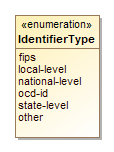

Enumeration for election data-related codes in the [ExternalIdentifier](#17_0_2_4_f71035d_1430405712653_451634_2410) class .

Name | Value
---- | -----
`fips`|For FIPS codes.
`local-level`|For a code that is specific to a county or other similar locality.
`national-level`|For a code that is used at the national level other than “fips” or “ocd-id”.
`ocd-id`|For Open Civic Data identifiers.
`state-level`|For a code that is specific to a state.
`other`|Used when the type of code is not included in this enumeration.

### *The **OfficeTermType** Enumeration*

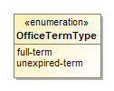

Enumeration for the office term type in the [Office](#17_0_5_1_43401a7_1400623830572_164081_3518) class.

Name | Value
---- | -----
`full-term`|When the officeholder’s term began at the beginning of the full term of the office, e.g., 6 years for U.S. Senate.
`unexpired-term`|When the officeholder’s term began at some date after the beginning of the full term of the office, generally because the previous officeholder vacated the office before the fullterm expired.

### *The **ReportDetailLevel** Enumeration*

Enumeration for the detail level of the election results report in the [Election](#17_0_2_4_f71035d_1426101822599_430942_2209) class.

Name | Value
---- | -----
`precinct-level`|For reports that contain counts from precincts in the reporting jurisdiction.
`summary-contest`|For reports that contain only aggregated counts.

### *The **ReportingUnitType** Enumeration*

Enumeration for the type of geopolitical unit in the [ReportingUnit](#17_0_2_4_f71035d_1400606476166_735297_2593) class.

Name | Value
---- | -----
`ballot-batch`|Used for reporting batches of ballots that may cross precinct boundaries.
`ballot-style-area`|Used for ballot style areas generally composed of precincts.
`borough`|Used in CT, NJ, PA, other states, and New York City for boroughs. For AK and LA, see county.
`city`|Used for a city that reports results and/or for the district that encompasses it.
`city-council`|Used for city council districts.
`combined-precinct`|Used for one or more precincts that have been combined for the purposes of reporting. Used for “Ward” if “Ward” is used interchangeably with “CombinedPrecinct”.
`congressional`|Used for U.S. Congressional districts.
`country`|Used for a reporting unit of type country.
`county`|Used for a county and/or for the district that encompasses it. In AK, used for counties that are called boroughs. In LA, used for parishes.
`county-council`|Used for county council districts.
`drop-box`|Used for a dropbox for absentee ballots.
`judicial`|Used for judicial districts.
`municipality`|Used as applicable for various units such as towns, townships, villages that report votes and/or for the district that encompasses it.
`polling-place`|Used for a polling place.
`precinct`|Used also for “Ward” or “District” when these terms are used interchangeably with “Precinct”.
`school`|Used for a school district.
`special`|Used for a special district.
`split-precinct`|Used for splits of precincts.
`state`|Used for a state and/or for the district that encompasses it.
`state-house`|Used for a state house or assembly district.
`state-senate`|Used for a state senate district.
`town`|Used in some New England states as a type of municipality that reports votes and/or for the district that encompasses it.
`township`|Used in some mid-western states as a type of municipality that reports votes and/or for the district that encompasses it.
`utility`|Used for a utility district.
`village`|Used as a type of municipality that reports votes and/or for the district that encompasses it.
`vote-center`|Used for a vote center.
`ward`|Used for combinations or groupings of precincts or other units.
`water`|Used for a water district.
`other`|Used for other types of reporting units not included in this enumeration.

### *The **ResultsStatus** Enumeration*

Enumeration for the status of the election results in the [ElectionReport](#17_0_2_4_78e0236_1389366195564_913164_2300) class.

Name | Value
---- | -----
`certified`|For results that have been certified by the election authority.
`correction`|For results that are a correction to an earlier report.
`pre-election`|For a pre-election data.
`recount`|For results that are a recount of an earlier election.
`unofficial-complete`|For results that are unofficial and complete, e.g., the complete election night results.
`unofficial-partial`|For results that are unofficial and partial, e.g., partial election night results.

### *The **VoteVariation** Enumeration*

Enumeration for contest decision algorithm or rules in the [Contest](#17_0_2_4_78e0236_1389366251994_876831_2400) element.

Name | Value
---- | -----
`approval`|When voter can select as many candidates as desired in a contest up to a maximum number.
`borda`|For the Borda count voting.
`cumulative`|When voter can allocate more than one vote to a given candidate.
`majority`|For majority voting.
`n-of-m`|Includes vote for 1, i.e., 1-of-m.
`plurality`|For plurality voting.
`proportional`|For proportional voting.
`range`|For range voting.
`rcv`|For ranked choice voting.
`super-majority`|For super majority voting.
`other`|Used when the vote variation type is not included in this enumeration.

## Classes

### *The **AnnotatedString** Class*

Used as a type for character strings; it adds a 16-character annotation to a character string.

Attribute | Multiplicity | Type | Attribute Description
--------- | ------------ | ---- | ---------------------
`Annotation`|0..1|`ShortString`|An annotation of up to 16 characters associated with a character string.
`Content`|1|`String`|The string to be annotated.

### *The **AnnotatedUri** Class*

Used as a type for character strings that represent Uniform Resource Identifiers (URI); it adds a 16-character annotation to a character string.

Attribute | Multiplicity | Type | Attribute Description
--------- | ------------ | ---- | ---------------------
`Annotation`|0..1|`ShortString`|An annotation of up to 16 characters associated with a character string.
`Content`|1|`anyURI`|The URI to be annotated.

### *The **BallotCounts** Class*

Used for identifying various ballot counts. It inherits the attributes of [Counts](#17_0_2_4_78e0236_1389367291663_284973_2835).

Attribute | Multiplicity | Type | Attribute Description
--------- | ------------ | ---- | ---------------------
`BallotsCast`|0..1|`Integer`|Number of ballots cast.
`BallotsOutstanding`|0..1|`Integer`|Number of ballots not yet counted.
`BallotsRejected`|0..1|`Integer`|Number of ballots rejected.

### *The **BallotMeasureContest** Class*

For ballot measure (i.e., referenda or a tax measure) and judicial retention contests. It inherits the attributes of [Contest](#17_0_2_4_78e0236_1389366251994_876831_2400).

If the type of ballot measure is not listed in enumeration [BallotMeasureType](#17_0_2_4_f71035d_1426549604222_56408_2487), use other and include the type (that is not listed in the enumeration) in [OtherType](#17_0_2_4_f71035d_1426550214099_344315_2520).

Attribute | Multiplicity | Type | Attribute Description
--------- | ------------ | ---- | ---------------------
`ConStatement`|0..1|`InternationalizedText`|For a statement on the ballot associated with a “no” vote.
`EffectOfAbstain`|0..1|`InternationalizedText`|For a statement on the ballot detailing the effect of abstaining from voting on the ballot measure.
`FullText`|0..1|`InternationalizedText`|For full text on the ballot of the ballot measure.
`InfoUri`|0..*|`AnnotatedUri`|For associating a URI with the ballot measure contest.
`PassageThreshold`|0..1|`InternationalizedText`|For a statement on the ballot of the number or percentage of votes needed to approve or pass the ballot measure.
`ProStatement`|0..1|`InternationalizedText`|For a statement on the ballot associated with a “yes” vote.
`SummaryText`|0..1|`InternationalizedText`|For a summary on the ballot of the ballot measure.
`Type`|0..1|`BallotMeasureType`|For indicating the type of ballot measure.
`OtherType`|0..1|`String`|Used when BallotMeasureType is other.

### *The **BallotMeasureSelection** Class*

For a contest selection in a ballot measure contest. Because judicial or other retention contests are often treated like ballot measure contests, this element can be used also for retention contests. It inherits the attributes of [ContestSelection](#17_0_2_4_78e0236_1389372124445_11077_2906).

Attribute | Multiplicity | Type | Attribute Description
--------- | ------------ | ---- | ---------------------
`ExternalIdentifier`|0..*|`ExternalIdentifier`|For associating an ID with the ballot measure selection.
`Selection`|1|`InternationalizedText`|Contains the text used to indicate a vote for or against the ballot measure, e.g., “yes”, “no”.

### *The **BallotStyle** Class*

For defining a ballot style composed of ordered content (i.e. Headers or Contests) and their contest selections, and associating the ballot style with a political party, a reference to an image of the ballot, and a reference to a precinct or other geopolitical unit that the ballot is unique to. [Election](#17_0_2_4_f71035d_1426101822599_430942_2209) includes BallotStyle.
BallotStyle references [OrderedContent](#18_5_3_43701b0_1527684342715_643544_6146) to include content that appears on that ballot style. To preserve any rotation associated with the ballot, it is expected that the generating application will list the occurrences of [OrderedContest](#17_0_3_43401a7_1394476416139_808596_3142) in the order as on the ballot for the associated geopolitical unit.
BallotStyle references one or more [GpUnit](#17_0_2_4_78e0236_1389366233346_42391_2380) instances defined for the associated precincts or split precincts. If the ballot style is associated with multiple precincts (or other geographies), multiple references to the precinct [GpUnit](#17_0_2_4_78e0236_1389366233346_42391_2380) instances can be included.

Attribute | Multiplicity | Type | Attribute Description
--------- | ------------ | ---- | ---------------------
`ExternalIdentifier`|0..*|`ExternalIdentifier`|For associating an ID with the ballot style.
`{GpUnit}`|1..*|`GpUnit`|Unique identifier for one or more GpUnit instances. For associating specific geopolitical units with the ballot style.
`ImageUri`|0..*|`AnnotatedUri`|URI for a ballot image.
`{OrderedContent}`|0..*|`OrderedContent`|For associating a ballot style with ballot content, such as contests or headers.
`{Party}`|0..*|`Party`|Unique identifier for one or more Party instances. For associating one or more parties with the ballot style.

### *The **Candidate** Class*

For defining information about a candidate in a contest. [CandidateSelection](#17_0_2_4_d420315_1392145640524_831493_2562) references Candidate instances to associate one or more candidates with a contest selection. [Election](#17_0_2_4_f71035d_1426101822599_430942_2209) includes Candidate.

Candidate uses the [Party](#17_0_2_4_78e0236_1389366597377_433664_2698) association to reference the candidate’s political party. If the candidate is endorsed by other parties for a particular contest, the endorsing parties are referenced using the [CandidateSelection](#17_0_2_4_d420315_1392145640524_831493_2562) attribute.

[ExternalIdentifier](#17_0_2_4_f71035d_1430405890311_465205_2454) can be used to associate an ID with the candidate. If the type is not listed in enumeration [IdentifierType](#17_0_2_4_f71035d_1425061188508_163854_2613), use other and include the type (that is not listed in the enumeration) in [OtherType](#17_0_2_4_f71035d_1430405732252_109247_2429).

Attribute | Multiplicity | Type | Attribute Description
--------- | ------------ | ---- | ---------------------
`BallotName`|1|`InternationalizedText`|For the candidate’s name as listed on the ballot.
`CampaignSlogan`|0..1|`InternationalizedText`|The slogan or motto used by the candidate in their campaign.
`{ContactInformation}`|0..1|`ContactInformation`|For associating contact information for the candidate.
`ExternalIdentifier`|0..*|`ExternalIdentifier`|For associating codes with the candidate.
`FileDate`|0..1|`date`|Date when the candidate filed for the contest.
`IsIncumbent`|0..1|`Boolean`|Boolean to indicate whether the candidate is the incumbent for the office associated with the contest. Assumed to be “no” if not present.
`IsTopTicket`|0..1|`Boolean`|Boolean to indicate whether the candidate is the top of a ticket that includes multiple candidates. Assumed to be “no” if not present.
`{Party}`|0..1|`Party`|For associating a party with the candidate.
`{Person}`|0..1|`Person`|For associating more detailed information about the candidate.
`PostElectionStatus`|0..1|`CandidatePostElectionStatus`|Final status of the candidate, e.g., winner, withdrawn, etc.
`PreElectionStatus`|0..1|`CandidatePreElectionStatus`|Registration status of the candidate, e.g., filed, qualified, etc.

### *The **CandidateContest** Class*

For a contest that involves selecting one or more candidates. It inherits the attributes of [Contest](#17_0_2_4_78e0236_1389366251994_876831_2400).

This class optionally references [Office](#17_0_5_1_43401a7_1400623830572_164081_3518) and [Party](#17_0_2_4_78e0236_1389366278128_412819_2460). If the candidate contest is associated with a ticket (of candidates) and each candidate in the ticket is associated with a separate office, the [association to Office](#17_0_5_1_43401a7_1400624734486_732685_3699) can reference each of the separate offices. For example, if the contest is for the state governor ticket but Governor and Lieutenant (Lt.) Governor are both separate offices, the association references first to the [Office](#17_0_5_1_43401a7_1400623830572_164081_3518) instance defined for the Governor’s office and then to the Lt. Governor’s office. In this case, it is expected that the generating application will list the multiple references according to a jurisdiction-defined ordering scheme, e.g., Governor first and Lt. Governor second.

Note that when using the [CandidateSelection](#17_0_2_4_d420315_1392145640524_831493_2562) class to associate the candidates with a contest selection for the contest, the order of the candidates should match the order of offices. Again, using the example of the state governor ticket, if the offices are listed with Governor first and Lt. Governor second, then the order of the candidates in the [ContestSelection](#17_0_2_4_78e0236_1389372124445_11077_2906) instance should be identical, with the Governor candidate first and the Lt. Governor candidate second.

Attribute | Multiplicity | Type | Attribute Description
--------- | ------------ | ---- | ---------------------
`NumberElected`|0..1|`Integer`|Number of candidates that are elected in the contest (“n” of n-of-m).
`NumberRunoff`|0..1|`Integer`|The number of candidates in a runoff contest.
`{Office}`|0..*|`Office`|For associating office descriptions.
`{PrimaryParty}`|0..*|`Party`|For associating parties with the contest.
`VotesAllowed`|1|`Integer`|Maximum number of votes per voter in this contest.

### *The **CandidateSelection** Class*

For the contest selections in a candidate contest, including for write-ins. It inherits the attributes of [ContestSelection](#17_0_2_4_78e0236_1389372124445_11077_2906). References to multiple [Candidate](#17_0_2_4_78e0236_1389366272694_544359_2440) instances can be included if necessary, e.g., when the contest selection would be for a ticket of candidates (unless the ticket itself is defined as a candidate).

[EndorsementParty](#17_0_2_4_d420315_1391370669921_519404_2559) is used to reference any associated endorsement parties other than the specific party of the candidate ([Candidate](#17_0_2_4_78e0236_1389366272694_544359_2440) references [Party](#17_0_2_4_78e0236_1389366278128_412819_2460) for that purpose). For example, if a candidate of one party is also endorsed by a second party, use [EndorsementParty](#17_0_2_4_d420315_1391370669921_519404_2559) to reference the second party. A second example would be for ballot fusion as used in some states, where the same candidate is listed multiple times in the same contest, but with different endorsement parties.

When multiple candidates are referenced for a ticket and the ordering of the candidates is important to preserve, it is expected that the generating application will list the references to [Candidate](#17_0_2_4_d420315_1392145686219_781480_2594) instances according to the ordering scheme in place. For example, if the contest is for a ticket in which each candidate is associated with a different office, then the order of the candidates should match the same ordering of the <Office> element references within <OfficeIds> in the <Contest xsi:type="CandidateContest" ... /> element.

Attribute | Multiplicity | Type | Attribute Description
--------- | ------------ | ---- | ---------------------
`{Candidate}`|0..*|`Candidate`|For associating a candidate with the candidate selection on the ballot and for cases where the contest selection is for multiple candidates, e.g., a ticket.
`IsWriteIn`|0..1|`Boolean`|Indicates whether the candidate is a write-in, e.g., true or false. Assumed to be false if not present.
`{EndorsementParty}`|0..*|`Party`|For associating one or more endorsing parties with the candidate selection.

### *The **Coalition** Class*

For defining a coalition, i.e., a collection of parties organized for the purpose of endorsing a candidate in a contest. It inherits the attributes and elements of [Party](#17_0_2_4_78e0236_1389366278128_412819_2460).

Coalition instances themselves are composed of multiple [Party](#17_0_2_4_78e0236_1389366278128_412819_2460) references along with a reference to an associated [Contests](#17_0_2_4_78e0236_1389366251994_876831_2400).

If there are no associated [Contests](#17_0_2_4_78e0236_1389366251994_876831_2400), a general default is that the coalition endorses the associated parties.

Attribute | Multiplicity | Type | Attribute Description
--------- | ------------ | ---- | ---------------------
`{Contest}`|0..*|`Contest`|For associating contests with the coalition.
`{Party}`|0..*|`Party`|For associating parties with the coalition.

### *The **ContactInformation** Class*

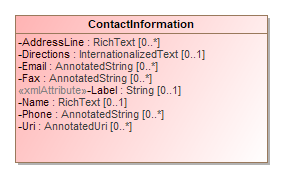

For defining contact information about objects such as persons, boards of authorities, organizations, etc. [Election](#17_0_2_4_f71035d_1426101822599_430942_2209), [ElectionAdministration](#18_0_2_6340208_1441311877439_710008_4433), [Person](#17_0_5_1_43401a7_1400623980732_100904_3567), [GpUnit](#17_0_2_4_78e0236_1389366233346_42391_2380), and [Office](#17_0_5_1_43401a7_1400623830572_164081_3518) include ContactInformation.

To include an address for the contact, use multiple occurrences of [AddressLine](#18_0_2_6340208_1425645912998_115448_4529). It is expected that the generating application will list the name of the person/organization in the first occurrence of [AddressLine](#18_0_2_6340208_1425645912998_115448_4529), with subsequent ordered occurrences for street address, city, state, zip code, etc. [Directions](#17_0_2_4_f71035d_1443105112875_46223_2290) can be used to supply any additional address-related information that may appear in multiple languages.

ContactInformation includes [LatLng](#17_0_2_4_f71035d_1443104838926_393729_2222) so as to associate latitude/longitude with the contact address.

[Email](#17_0_5_1_43401a7_1400668036651_743620_3650), [Fax](#17_0_5_1_43401a7_1400668021448_721992_3646), and [Phone](#17_0_5_1_43401a7_1400667951215_637516_3638) are of type [AnnotatedString](#18_0_2_6340208_1497553224568_429892_4565), which permits up to a 16-character annotation to be associated with the data.

Attribute | Multiplicity | Type | Attribute Description
--------- | ------------ | ---- | ---------------------
`AddressLine`|0..*|`RichText`|For associating an address with the contact.
`Directions`|0..1|`InternationalizedText`|Directional information in addition to address information.
`Email`|0..*|`AnnotatedString`|Email address associated with the contact.
`Fax`|0..*|`AnnotatedString`|Fax number associated with the contact.
`Label`|0..1|`String`|For use as needed and compatibility with the VIP schema.
`{LatLng}`|0..1|`LatLng`|For latitude and longitude information associated with the contact.
`Name`|0..1|`RichText`|Name associated with the contact.
`Phone`|0..*|`AnnotatedString`|Phone number associated with the contact.
`{Schedule}`|0..*|`Schedule`|For associating a schedule with the contact.
`Uri`|0..*|`AnnotatedUri`|URI associated with the contact.

### *The **Contest** Class*

For defining a contest and linking the contest to the associated candidates, ballot measures, parties, or retention contests. [Election](#17_0_2_4_f71035d_1426101822599_430942_2209) includes Contest.

Contest is an abstract class with four subclasses that get used according to the type of contest:

 *  [BallotMeasureContest](#17_0_2_4_78e0236_1389366932057_929676_2783), used for a contest involving a ballot measure
 *  [CandidateContest](#17_0_2_4_78e0236_1389366970084_183781_2806), used for a contest involving one or more candidates for an office
 *  [PartyContest](#17_0_2_4_d420315_1393514218965_55008_3144), used for a contest for a straight party selection on the ballot
 *  [RetentionContest](#18_0_2_6340208_1425646217522_163181_4554), used for a judicial or other type of retention contest 

Contest includes [ContestSelection](#17_0_2_4_78e0236_1389372124445_11077_2906) to link the selections on the ballot to the contest, e.g., to link one or more candidates to a candidate contest. Like Contest, [ContestSelection](#17_0_2_4_78e0236_1389372124445_11077_2906) is also an abstract class and has subclasses that correspond to those of Contest, as follows: 

 *  [BallotMeasureContest](#17_0_2_4_78e0236_1389366932057_929676_2783) includes [BallotMeasureSelection](#17_0_2_4_78e0236_1389372163799_981952_2926)
 *  [CandidateContest](#17_0_2_4_78e0236_1389366970084_183781_2806) includes [CandidateSelection](#17_0_2_4_d420315_1392145640524_831493_2562)
 *  [PartyContest](#17_0_2_4_d420315_1393514218965_55008_3144) includes [PartySelection](#17_0_2_4_f71035d_1426519980658_594892_2511)
 *  [RetentionContest](#18_0_2_6340208_1425646217522_163181_4554) includes [BallotMeasureSelection](#17_0_2_4_78e0236_1389372163799_981952_2926)

[Contest](#17_0_2_4_78e0236_1389366251994_876831_2400) includes a required [ElectionDistrict](#17_0_2_4_78e0236_1389366667508_703141_2753) reference to a [GpUnit](#17_0_2_4_78e0236_1389366233346_42391_2380) defined for the geographical scope of the contest. For example, in a state senate contest, [ElectionDistrict](#17_0_2_4_78e0236_1389366667508_703141_2753) would reference a [GpUnit](#17_0_2_4_78e0236_1389366233346_42391_2380) of type [ReportingUnit](#17_0_2_4_f71035d_1400606476166_735297_2593) element defined for the district associated with the contest. [Office](#17_0_5_1_43401a7_1400623830572_164081_3518) also includes an optional reference that serves the same purpose. Note that for contests that are state-wide or county-wide and so forth, the same [GpUnit](#17_0_2_4_78e0236_1389366233346_42391_2380) defined for the state or county, etc., can be re-used.
[Contest](#17_0_2_4_78e0236_1389366251994_876831_2400) includes [OtherCounts](#18_0_2_6340208_1508176198256_527421_4561) for providing a summary of miscellaneous counts associated with the contest, including total number of ballots cast containing the contest, total number of overvotes, undervotes, or write-ins. The summary counts can be associated with the contest as a whole, or with precincts or other lower-level reporting units by using multiple occurrences of [OtherCounts](#18_0_2_6340208_1508176198256_527421_4561).
[SequenceOrder](#17_0_2_4_f71035d_1426083547931_912709_2690) is used for results display ordering, i.e., to display contests according to a particular ordering. For example, “100” may indicate a U.S. Senatorial contest, “200” may indicate a U.S. Congressional contest, etc. [SequenceOrder](#17_0_2_4_f71035d_1426083547931_912709_2690) is not appropriate to use as the contest order on the ballot; contest order on each ballot can be preserved, however, using the [BallotStyle](#17_0_2_4_78e0236_1389366224561_797289_2360) element, which associates ballot styles with their corresponding precincts or other geopolitical units.
When including [ExternalIdentifiers](#17_0_2_4_f71035d_1430405712653_451634_2410), if the type is not listed in enumeration [IdentifierType](#17_0_2_4_f71035d_1425061188508_163854_2613), use other and include the type (that is not listed in the enumeration) in [OtherType](#17_0_2_4_f71035d_1430405732252_109247_2429).

Attribute | Multiplicity | Type | Attribute Description
--------- | ------------ | ---- | ---------------------
`Abbreviation`|0..1|`String`|Abbreviation for the contest.
`BallotSubTitle`|0..1|`InternationalizedText`|Subtitle of the contest as it appears on the ballot.
`BallotTitle`|0..1|`InternationalizedText`|Title of the contest as it appears on the ballot.
`{ContestSelection}`|0..*|`ContestSelection`|For associating a contest selection for the contest, i.e., a candidate, a ballot measure.
`{OtherCounts}`|0..*|`OtherCounts`|For associating counts such as overvote and undervotes with the contest.
`CountStatus`|0..*|`CountStatus`|For providing various counting status associated with the contest.
`{ElectionDistrict}`|1|`ReportingUnit`|Link to a [GpUnit](#17_0_2_4_78e0236_1389366233346_42391_2380) instance. For associating the contest with a reporting unit that represents the geographical scope of the contest, e.g., a district, etc.
`ExternalIdentifier`|0..*|`ExternalIdentifier`|For associating an ID with the contest.
`HasRotation`|0..1|`Boolean`|Boolean to indicate whether the selections in the contest are rotated. Assumed to be “no” if not present.
`Name`|1|`RichText`|Name of the contest, not necessarily as it appears on the ballot.
`SequenceOrder`|0..1|`Integer`|Orderering for listing the contest for purposes of results display. If not present, no order is assumed.
`SubUnitsReported`|0..1|`Integer`|Number of subunits, e.g., precincts, that have completed reporting votes for this contest.
`TotalSubUnits`|0..1|`Integer`|Total number of subunits, e.g., precincts that have this contest on the ballot.
`VoteVariation`|0..1|`VoteVariation`|Vote variation associated with the contest, e.g., n-of-m.
`OtherVoteVariation`|0..1|`String`|For use when [VoteVariation](#17_0_2_4_78e0236_1389798198604_276106_4268) is other.

### *The **ContestSelection** Class*

Used for the contest selections in a contest (e.g., for candidates, for ballot measures) and to generally link them to vote counts. [Contest](#17_0_2_4_78e0236_1389366251994_876831_2400) includes [ContestSelection](#17_0_2_4_78e0236_1389372124445_11077_2906).

[ContestSelection](#17_0_2_4_78e0236_1389372124445_11077_2906) is an abstract class with three subclasses that get used according to the type of contest:

 *  [BallotMeasureSelection](#17_0_2_4_78e0236_1389372163799_981952_2926), used if the contest type is for a ballot measure, including for retentions
 *  [CandidateSelection](#17_0_2_4_d420315_1392145640524_831493_2562), used if the contest type is for one or more candidates, to link the contest selection to the candidate instances and endorsement parties; and
 *  [PartySelection](#17_0_2_4_f71035d_1426519980658_594892_2511), used if the contest type is for a party, e.g., for a straight party contest. [ContestSelection](#17_0_2_4_78e0236_1389372124445_11077_2906) includes [VoteCounts](#17_0_2_4_78e0236_1389372026000_187007_2862) for associating vote counts with the contest selection.
 *  [SequenceOrder](#17_0_2_4_f71035d_1426296042287_22607_2200) is included to specify an ordering for the contest selections for purposes of display only. The original ballot ordering can be preserved, however, by using the [BallotStyle](#17_0_2_4_78e0236_1389366224561_797289_2360) class.

Attribute | Multiplicity | Type | Attribute Description
--------- | ------------ | ---- | ---------------------
`SequenceOrder`|0..1|`Integer`|Order in which the candidate is listed on the ballot for purposes of results display. If not present, no order is assumed.
`{VoteCounts}`|0..*|`VoteCounts`|For associating the contest selection’s vote counts.

### *The **Counts** Class*

Used for reporting on contest vote counts. Contains attributes to categorize the counts according to voting classification (e.g., election day, early voting, etc.) and type of device on which the votes were cast (e.g., DRE, accessible device, etc.).

Attribute | Multiplicity | Type | Attribute Description
--------- | ------------ | ---- | ---------------------
`DeviceClass`|0..1|`DeviceClass`|For filtering counts by device type.
`{GpUnit}`|1|`GpUnit`|For filtering counts by political geography or device or device type.
`IsSuppressedForPrivacy`|0..1|`Boolean`|Boolean to indicate if votes are suppressed for voter privacy, e.g., true or false. Assumed to be false if not present.
`Round`|0..1|`Integer`|An identification of the RCV round being reported.
`Type`|1|`CountItemType`|The type of count being used as a filter on the vote counts, e.g., election day, early voting, etc.
`OtherType`|0..1|`String`|Used when Type is other.

### *The **CountStatus** Class*

For reporting on the counting status for various items such as ballot types or write-ins, e.g., whether for a certain type of ballot, the counts are in progress, not yet started, complete, etc. [Contest](#17_0_2_4_78e0236_1389366251994_876831_2400), [Election](#17_0_2_4_f71035d_1426101822599_430942_2209), and [GpUnit](#17_0_2_4_78e0236_1389366233346_42391_2380) include CountStatus.

If the type of count item is not listed in enumeration [CountItemType](#17_0_2_4_78e0236_1389798097477_664878_4228), use other and include the type (that is not listed in the enumeration) in [OtherType](#17_0_2_4_f71035d_1426077858771_890955_2661).

Attribute | Multiplicity | Type | Attribute Description
--------- | ------------ | ---- | ---------------------
`Status`|1|`CountItemStatus`|The status of the count, from the [CountItemStatus](#17_0_2_4_78e0236_1389797161173_369293_4078) enumeration.
`Type`|1|`CountItemType`|The type of item, from the [CountItemType](#17_0_2_4_78e0236_1389798097477_664878_4228) enumeration.
`OtherType`|0..1|`String`|Used when Type is other.

### *The **DateTimeWithZone** Class*

Restricts dateTime to require inclusion of time zone information and excludes fractional seconds.

Attribute | Multiplicity | Type | Attribute Description
--------- | ------------ | ---- | ---------------------
`pattern`||`String`|Pattern used for indicating the date, time and the accompanying time zone.

### *The **DeviceClass** Class*

For filtering vote counts by device-related information. [GpUnit](#17_0_2_4_78e0236_1389366233346_42391_2380), [Counts](#17_0_2_4_78e0236_1389367291663_284973_2835), and [OtherCounts](#18_0_2_6340208_1508176198256_527421_4561) include [DeviceClass](#18_0_2_6340208_1425911626288_420556_4530).

Attribute | Multiplicity | Type | Attribute Description
--------- | ------------ | ---- | ---------------------
`Manufacturer`|0..1|`String`|Manufacturer of the device.
`Model`|0..1|`String`|Manufacturer’s device model, used to filter on, e.g., a specific model of DRE or other device type.
`Type`|0..1|`DeviceType`|Enumerated type of device, e.g., "dre", "opscan-precinct", etc.
`OtherType`|0..1|`String`|Used when Type is other.

### *The **Election** Class*

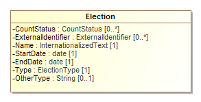

For defining the status of the election and associated information such as candidates, contests, and vote counts.

Election includes links to the major instances that are specific to an election: [BallotStyle](#17_0_2_4_78e0236_1389366224561_797289_2360), [Candidate](#17_0_2_4_78e0236_1389366272694_544359_2440), and [Contest](#17_0_2_4_78e0236_1389366251994_876831_2400).

Election includes a required association end [ElectionScope](#17_0_2_4_f71035d_1426102211616_609900_2331), which links to a [GpUnit](#17_0_2_4_78e0236_1389366233346_42391_2380) instance for the purpose of identifying the geographical scope of the election. For example, for an election within a county, [ElectionScope](#17_0_2_4_f71035d_1426102211616_609900_2331) would reference a [GpUnit](#17_0_2_4_78e0236_1389366233346_42391_2380) defined for the county. If it is desired to include election authority information, the [GpUnit](#17_0_2_4_78e0236_1389366233346_42391_2380) can include [ElectionAdministration](#18_0_2_6340208_1441311877439_710008_4433).

Attribute | Multiplicity | Type | Attribute Description
--------- | ------------ | ---- | ---------------------
`{BallotCounts}`|0..*|`BallotCounts`|Used for identifying various ballot counts.
`{BallotStyle}`|0..*|`BallotStyle`|For defining ballot styles associated with the election.
`{Candidate}`|0..*|`Candidate`|For defining candidates associated with the election.
`{ContactInformation}`|0..1|`ContactInformation`|For associating various contact information with the election.
`{Contest}`|0..*|`Contest`|For defining contests associated with the election.
`CountStatus`|0..*|`CountStatus`|For providing various counting status on types of ballots or other items.
`{ElectionScope}`|1|`ReportingUnit`|Unique identifier for a [GpUnit](#17_0_2_4_78e0236_1389366233346_42391_2380) element. For associating the election with a reporting unit that represents the geographical scope of the election, e.g., a state, a county, etc.
`ExternalIdentifier`|0..*|`ExternalIdentifier`|For associating an ID with the election.
`Name`|1|`InternationalizedText`|For including a name for the election; the name could be the same name as appears on the ballot.
`StartDate`|1|`date`|Calendar start date of the election, e.g., “2018-11-04”.
`EndDate`|1|`date`|Calendar end date of the election; for a typical one-day election, the end date is the same as the start date.
`Type`|1|`ElectionType`|Enumerated type of election, e.g., partisan-primary, open-primary, etc.
`OtherType`|0..1|`String`|Used when [Type](#17_0_2_4_f71035d_1426101886743_683410_2236) is other.

### *The **ElectionAdministration** Class*

Used to provide various information about an election authority. [ReportingUnit](#17_0_2_4_f71035d_1400606476166_735297_2593) includes ElectionAdministration.

ElectionAdministration includes [ContactInformation](#17_0_5_1_43401a7_1400624327407_326048_3637) for the election authority and, using [ElectionOfficialPerson](#18_0_2_6340208_1441312523523_377380_4513) references one or more [Person](#17_0_5_1_43401a7_1400623980732_100904_3567) instances defined for individuals/organizations associated with the election authority.

Attribute | Multiplicity | Type | Attribute Description
--------- | ------------ | ---- | ---------------------
`{ContactInformation}`|0..1|`ContactInformation`|For including various contact information.
`{ElectionOfficialPerson}`|0..*|`Person`|Unique identifier for one or more Person elements defined for the election authority.
`Name`|0..1|`RichText`|Name of the election authority.

### *The **ElectionReport** Class*

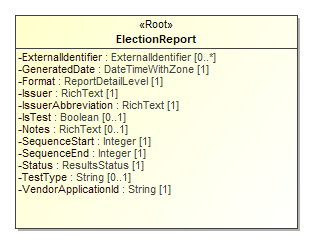

For defining items pertaining to the status and format of the report and when it was generated.

ElectionReport references the major elements that are not necessarily specific to an election and that therefore can exist in a pre-election report: [GpUnit](#17_0_2_4_78e0236_1389366233346_42391_2380), [Office](#17_0_5_1_43401a7_1400623830572_164081_3518) and [OfficeGroup](#17_0_2_4_f71035d_1433183615993_866714_2239), [Party](#17_0_2_4_78e0236_1389366278128_412819_2460), [Person](#17_0_5_1_43401a7_1400623980732_100904_3567), and [Election](#17_0_2_4_f71035d_1426101822599_430942_2209).

Attribute | Multiplicity | Type | Attribute Description
--------- | ------------ | ---- | ---------------------
`{Election}`|0..*|`Election`|For associating elections with the report.
`ExternalIdentifier`|0..*|`ExternalIdentifier`|For associating an ID with the report.
`Format`|1|`ReportDetailLevel`|Detail level of the report, e.g., contest summary, precinct level results, etc.
`GeneratedDate`|1|`DateTimeWithZone`|Identifies the date and time that the election report was generated.
`{GpUnit}`|0..*|`GpUnit`|For associating geopolitical units with the report.
`{Header}`|0..*|`Header`|For associating headers with parts of a ballot style.
`Issuer`|1|`RichText`|Identification of the report issuer.
`IssuerAbbreviation`|1|`RichText`|An abbreviation of the report issuer such as the 2-character U.S. Census Bureau abbreviation of the state whose results are being reported, e.g., AL, TX, MN, etc.
`IsTest`|0..1|`Boolean`|Used to indicate whether the report is a test report. Assumed to be “false” if not present.
`Notes`|0..1|`RichText`|For including an arbitrary message with the report.
`{Office}`|0..*|`Office`|For associating offices with the report.
`{OfficeGroup}`|0..*|`OfficeGroup`|For associating a name for a grouping of offices with the report.
`{Party}`|0..*|`Party`|For associating parties with the report.
`{Person}`|0..*|`Person`|For associating persons with the report.
`SequenceStart`|1|`Integer`|The report’s number as part of a sequence of reports, used with  so as to be read as, e.g., 1 of 1, 1 of 2, 2 of 2, etc. Starts with “1”.
`SequenceEnd`|1|`Integer`|The upper bound of the sequence; e.g., “1” if there is only 1 report, “2” if there are two reports in the sequence, etc.
`Status`|1|`ResultsStatus`|Status of the election report, e.g., test mode, unofficial, etc.
`TestType`|0..1|`String`|A description of the type of test, e.g., pre-election, logic and accuracy, etc.
`VendorApplicationId`|1|`String`|An identifier of the vendor application generating the election report, e.g., X-EMS version 3.1.a.

### *The **ExternalIdentifier** Class*

For associating a jurisdiction’s codes, i.e., identifiers, with objects such as candidates, offices, or geopolitical units such as counties, towns, precincts, etc. Multiple occurrences of the ExternalIdentifier sub-element can be used to associate multiple codes, e.g., if there is a desire to associate multiple codes with a particular object such as FIPS (Federal Information Processing Standard) codes as well as OCD-IDs (Open Civic Data Identifiers).

For elements that link to ExternalIdentifier instances, if the type is not listed in enumeration [IdentifierType](#17_0_2_4_f71035d_1425061188508_163854_2613), use other and include the type (that is not listed in the enumeration) in [OtherType](#17_0_2_4_f71035d_1430405732252_109247_2429).

Attribute | Multiplicity | Type | Attribute Description
--------- | ------------ | ---- | ---------------------
`Label`|0..1|`String`|For use as needed and compatibility with the VIP schema.
`Type`|1|`IdentifierType`|An identifier type, e.g., FIPS.
`OtherType`|0..1|`String`|Used when [IdentifierType](#17_0_2_4_f71035d_1430405763078_743585_2433) value is other.
`Value`|1|`String`|The identifier used by the jurisdiction.

### *The **GpUnit** Class*

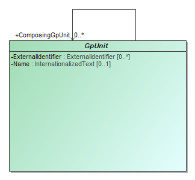

Class for describing a geo-politically bounded area of geography such as a city, district, or jurisdiction, or a precinct or split-precinct, or specific vote-capture device, for the purpose of associating contest vote counts and ballot counts (and other information) with the reporting unit. Reporting units can link to each other to form a hierarchicallly-oriented model of a state's (or a county's, etc.) jurisdictions, districts, and precincts.

[GpUnit](#17_0_2_4_78e0236_1389366233346_42391_2380) is an abstract class with two subclasses that get used according to the type of unit:

 *  [ReportingDevice](#17_0_2_4_78e0236_1389798013459_389380_4178), used for associating vote counts with a specific vote-capture device
 *  [ReportingUnit](#17_0_2_4_f71035d_1400606476166_735297_2593), for associating vote counts with geopolitical units such as cities, districts, counties, precincts, etc.

[Election](#17_0_2_4_f71035d_1426101822599_430942_2209) and [Contest](#17_0_2_4_78e0236_1389366251994_876831_2400) contain a required reference to [GpUnit](#17_0_2_4_78e0236_1389366233346_42391_2380) representing the jurisdiction of the election or contest respectively; [Office](#17_0_5_1_43401a7_1400623830572_164081_3518) contains a similar reference that is optional.  OtherCounts and VoteCounts reference [GpUnit](#17_0_2_4_78e0236_1389366233346_42391_2380) to link vote or summary counts to [GpUnit](#17_0_2_4_78e0236_1389366233346_42391_2380) instances defined for precincts or other types of geopolitical units.  [BallotStyle](#17_0_2_4_78e0236_1389366224561_797289_2360) references [GpUnit](#17_0_2_4_78e0236_1389366233346_42391_2380) to link a ballot style to its corresponding geopolitical unit.

Attribute | Multiplicity | Type | Attribute Description
--------- | ------------ | ---- | ---------------------
`{ComposingGpUnit}`|0..*|`GpUnit`|Unique identifier for one or more GpUnit instances. For creating a reference to another GpUnit that is contained with the parent GpUnit.
`ExternalIdentifier`|0..*|`ExternalIdentifier`|For associating an ID with the GpUnit, e.g., a district’s or county’s code.
`Name`|0..1|`InternationalizedText`|Name of the geopolitical unit.

### *The **Header** Class*

For defining a reusable set of headers.

Attribute | Multiplicity | Type | Attribute Description
--------- | ------------ | ---- | ---------------------
`ExternalIdentifier`|0..*|`ExternalIdentifier`|For associating an ID with the header.
`Name`|1|`InternationalizedText`|Name of the header, as it is to appear on a ballot style.

### *The **Hours** Class*

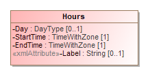

Hours is used to specify a specific day and hours on that day, including the time zone. Multiple occurrences of Hours can be used if the schedule includes a range of days and hours.

Attribute | Multiplicity | Type | Attribute Description
--------- | ------------ | ---- | ---------------------
`Day`|0..1|`DayType`|Day of the week.
`Label`|0..1|`String`|For use as needed and compatibility with the VIP schema.
`StartTime`|1|`TimeWithZone`|Start time of the schedule.
`EndTime`|1|`TimeWithZone`|End time of the schedule.

### *The **HtmlColorString** Class*

For a string containing a 6-digit Red-Green-Blue (RGB) code that can be displayed using HTML. Used in Party to associate a web-displayable color with the party. The RGB code is specified in hexadecimal, such that the RGB code for the color green is “00FF00” (“\#00” + “\#FF” + “\#00”).

Attribute | Multiplicity | Type | Attribute Description
--------- | ------------ | ---- | ---------------------
`pattern`||`String`|Pattern used for indicating the RGB color to use.

### *The **InternationalizedText** Class*

For strings that can contain multi-national text, for use with text as shown on a ballot containing multi-national text. The Identifier attribute can be used to assign an identifier to the text as desired.

[Text](#17_0_2_4_f71035d_1428953680100_198341_2225) uses the xsd:language type such that its language attribute must be set to a value that identifies the language.

Values for language are from ISO 639 \[12\] and include:

 *  en – English
 *  en-US – U.S. English
 *  en-GB – U.K. English
 *  fr – French
 *  es – Spanish
 *  zh – Chinese
 *  ja – Japanese
 *  ko – Korean

Attribute | Multiplicity | Type | Attribute Description
--------- | ------------ | ---- | ---------------------
`Label`|0..1|`String`|For use as needed and compatibility with the VIP schema.
`{Text}`|1..*|`LanguageString`|Used to hold a string of text with an associated table indicating the language used.

### *The **LanguageString** Class*

Used to hold a string of text with an associated table indicating the language used.

Attribute | Multiplicity | Type | Attribute Description
--------- | ------------ | ---- | ---------------------
`Content`|1|`String`|The string in the specified language.
`Language`|1|`language`|Identification of the language, such as 'es'.

### *The **LatLng** Class*

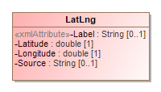

Associates latitude/longitude with a contact address.

Attribute | Multiplicity | Type | Attribute Description
--------- | ------------ | ---- | ---------------------
`Label`|0..1|`String`|For use as needed and compatibility with the VIP schema.
`Latitude`|1|`double`|Latitude of the contact location.
`Longitude`|1|`double`|Longitude of the contact location.
`Source`|0..1|`String`|System used to perform the lookup from location name to lat/lng, e.g., the name of a geocoding service.

### *The **Office** Class*

For defining an office and information associated with a contest and/or a district. [ElectionReport](#17_0_2_4_78e0236_1389366195564_913164_2300) includes Office. [CandidateContest](#17_0_2_4_78e0236_1389366970084_183781_2806) and [RetentionContest](#18_0_2_6340208_1425646217522_163181_4554) reference Office.

Office includes [Term](#17_0_2_4_f71035d_1428489072598_282236_2217) for defining details about the term of an office such as start/end dates and the type of term. [OfficeGroup](#17_0_2_4_f71035d_1433183615993_866714_2239) is included from [ElectionReport](#17_0_2_4_78e0236_1389366195564_913164_2300) to assign a name to a grouping of office definitions.

Office includes an optional [ElectionDistrict](#17_0_5_1_43401a7_1400701616170_933421_3684) reference to a [GpUnit](#17_0_2_4_78e0236_1389366233346_42391_2380) for the purpose of identifying the geographical scope of the office. For example, for an office for a state senate seat, [ElectionDistrict](#17_0_5_1_43401a7_1400701616170_933421_3684) would include a reference to the [GpUnit](#17_0_2_4_78e0236_1389366233346_42391_2380) defined for the district associated with that office.

Attribute | Multiplicity | Type | Attribute Description
--------- | ------------ | ---- | ---------------------
`{ContactInformation}`|0..1|`ContactInformation`|For associating various contact information with the office.
`Description`|0..1|`InternationalizedText`|A description of the office, possibly as shown on the ballot to the voter.
`{ElectionDistrict}`|0..1|`ReportingUnit`|Link to a [GpUnit](#17_0_2_4_78e0236_1389366233346_42391_2380) instance. For associating the office with a reporting unit that represents the geographical scope of the contest, e.g., a district, etc.
`ExternalIdentifier`|0..*|`ExternalIdentifier`|For associating an ID with the office.
`FilingDeadline`|0..1|`date`|Date and time when a candidate must have filed for the contest for the office.
`IsPartisan`|0..1|`Boolean`|Boolean to indicate whether the office is partisan, e.g., true or false. If not present, assumption is true.
`Name`|1|`InternationalizedText`|Name of the office; can appear on the ballot.
`{OfficeHolderPerson}`|0..*|`Person`|Links to one or more [Person](#17_0_5_1_43401a7_1400623980732_100904_3567) instances defined for the office holder.
`{Term}`|0..1|`Term`|For including office term-related information.

### *The **OfficeGroup** Class*

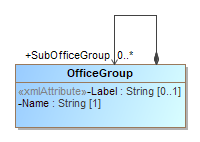

Used to assign a name to a grouping of office definitions. It includes references to [Office](#17_0_5_1_43401a7_1400623830572_164081_3518) instances and a name to identify the grouping of references, e.g., “Judicial” or “Statewide”, etc. SubOfficeGroup can be used to create a nested hierarchy of groupings. [ElectionReport](#17_0_2_4_78e0236_1389366195564_913164_2300) includes OfficeGroup.

Attribute | Multiplicity | Type | Attribute Description
--------- | ------------ | ---- | ---------------------
`Label`|0..1|`String`|For use as needed and compatibility with the VIP schema.
`Name`|1|`String`|Name of the office grouping.
`{Office}`|0..*|`Office`|Link to one or more [Office](#17_0_5_1_43401a7_1400623830572_164081_3518) instances.
`{SubOfficeGroup}`|0..*|`OfficeGroup`|For defining a nested hierarchy of [Office](#17_0_5_1_43401a7_1400623830572_164081_3518) instance groupings.

### *The **OrderedContent** Class*

An abstract base class for content that can appear under a particular ballot style.

OrderedContent is an abstract class with two subclasses that get used according to the type of content:

 *  OrderedContest, used for the appearance of a contest.
 *  OrderedHeader, used for the appearance of a header, optionally with the inclusion of contests.

### *The **OrderedContest** Class*

For the appearance of a contest on a particular ballot style.

Attribute | Multiplicity | Type | Attribute Description
--------- | ------------ | ---- | ---------------------
`{Contest}`|1|`Contest`|The contest associated represented by OrderedContest.
`{OrderedContestSelection}`|0..*|`ContestSelection`|The contest selections for the ballot.

### *The **OrderedHeader** Class*

For the appearance of a header on a particular ballot style.

Attribute | Multiplicity | Type | Attribute Description
--------- | ------------ | ---- | ---------------------
`{Header}`|1|`Header`|Association to the header to be used.
`{OrderedContent}`|0..*|`OrderedContent`|For associating a header with ballot content, such as contests or nested headers.

### *The **OtherCounts** Class*

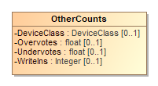

Identifies other counts associated with a contest.

Attribute | Multiplicity | Type | Attribute Description
--------- | ------------ | ---- | ---------------------
`DeviceClass`|0..1|`DeviceClass`|For filtering counts by device type.
`{GpUnit}`|1|`GpUnit`|For filter counts by political geography or device or device type.
`Overvotes`|0..1|`float`|Number of overvotes.
`Undervotes`|0..1|`float`|Number of undervotes.
`WriteIns`|0..1|`Integer`|Number of write-ins.

### *The **Party** Class*

Used to describe a political party that can then be referenced in other elements. [ElectionReport](#17_0_2_4_78e0236_1389366195564_913164_2300) includes Party. [Candidate](#17_0_2_4_78e0236_1389366272694_544359_2440), [PartyContest](#17_0_2_4_d420315_1393514218965_55008_3144), [PartyRegistration](#17_0_2_4_78e0236_1394566839296_58362_2826), and [Person](#17_0_5_1_43401a7_1400623980732_100904_3567) reference Party.

Party is an abstract type with one subtype [Coalition](#18_0_2_6340208_1425647247631_162984_4712), used to define coalitions.

The Color attribute specifies a 6-digit RGB code displayable using HTML.

Attribute | Multiplicity | Type | Attribute Description
--------- | ------------ | ---- | ---------------------
`Abbreviation`|0..1|`InternationalizedText`|Short name for the party, e.g., “DEM”.
`Color`|0..1|`HtmlColorString`|For associating an HTML RGB color coding with the party.
`{ContactInformation}`|0..1|`ContactInformation`|For associating contact information regarding the party, e.g., party offices.
`ExternalIdentifier`|0..*|`ExternalIdentifier`|For associating an ID with the party.
`IsRecognizedParty`|0..1|`Boolean`|For indicating whether the party is recognized by the election authority; “false” is assumed if not present.
`{LeaderPerson}`|0..*|`Person`|Identification of a Party's leader.
`LogoUri`|0..*|`AnnotatedUri`|A URI to the party’s graphical logo.
`Name`|1|`InternationalizedText`|Official full name of the party, e.g., “Republican”; can appear on the ballot.
`{PartyScopeGpUnit}`|0..*|`GpUnit`|The GpUnit(s) the party operates in or the top-most GpUnit.
`Slogan`|0..1|`InternationalizedText`|The slogan or motto used by a political party.

### *The **PartyContest** Class*

For a contest that involves choosing a party, typically for a straight party selection on the ballot.

### *The **PartyRegistration** Class*

For tracking the number of registered voters per party per geopolitical unit, i.e., for reporting on the number of registered voters of a particular party in a district or other type of reporting unit. Referenced by [GpUnit](#17_0_2_4_78e0236_1389366233346_42391_2380).

Attribute | Multiplicity | Type | Attribute Description
--------- | ------------ | ---- | ---------------------
`Count`|1|`Integer`|A count for tracking the number of registered voters.
`{Party}`|1|`Party`|Link to a [Party](#17_0_2_4_78e0236_1389366278128_412819_2460) instance. For associating a political party.

### *The **PartySelection** Class*

For a contest selection involving a party such as for a straight party selection on the ballot. It inherits the attributes of [ContestSelection](#17_0_2_4_78e0236_1389372124445_11077_2906).

Attribute | Multiplicity | Type | Attribute Description
--------- | ------------ | ---- | ---------------------
`{Party}`|1..*|`Party`|Link to one or more [Party](#17_0_2_4_78e0236_1389366278128_412819_2460) instances. For associating one or more parties with the party selection.

### *The **Person** Class*

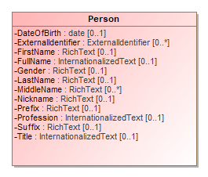

For defining information about a person; the person may be a candidate, election official, authority for a reporting unit, etc. [ElectionReport](#17_0_2_4_78e0236_1389366195564_913164_2300) includes Person. [Candidate](#17_0_2_4_78e0236_1389366272694_544359_2440) and [ElectionAdministration](#18_0_2_6340208_1441311877439_710008_4433) and
[GpUnit](#17_0_2_4_78e0236_1389366233346_42391_2380) references Person. Person optionally references [ContactInformation](#17_0_5_1_43401a7_1400624327407_326048_3637) for associating contact information.

Multiple occurrences of the MiddleName attribute can be used as needed, e.g., for names such as “John Andrew Winston Smith”.

Attribute | Multiplicity | Type | Attribute Description
--------- | ------------ | ---- | ---------------------
`{ContactInformation}`|0..*|`ContactInformation`|For associating contact information with the person.
`DateOfBirth`|0..1|`date`|Person’s date of birth.
`ExternalIdentifier`|0..*|`ExternalIdentifier`|For associating codes with the person.
`FirstName`|0..1|`RichText`|Person’s first (given) name.
`FullName`|0..1|`InternationalizedText`|Person’s full name.
`Gender`|0..1|`RichText`|Person’s gender.
`LastName`|0..1|`RichText`|Person’s last (family) name.
`MiddleName`|0..*|`RichText`|Person’s middle name.
`Nickname`|0..1|`RichText`|Nickname associated with the person.
`{Party}`|0..1|`Party`|Links to a [Party](#17_0_2_4_78e0236_1389366278128_412819_2460) instance. For associating a political party with the person.
`Prefix`|0..1|`RichText`|A prefix associated with the person, e.g., Mr.
`Profession`|0..1|`InternationalizedText`|Person’s profession.
`Suffix`|0..1|`RichText`|A suffix associated with the person, e.g., Jr.
`Title`|0..1|`InternationalizedText`|A title associated with the person.

### *The **ReportingDevice** Class*

Class/element describing a specific vote-capture device.

Attribute | Multiplicity | Type | Attribute Description
--------- | ------------ | ---- | ---------------------
`DeviceClass`|0..1|`DeviceClass`|Used for reporting on details about the type of voting device used for the results in question.
`SerialNumber`|0..1|`RichText`|Device's serial number or other unique identifier.

### *The **ReportingUnit** Class*

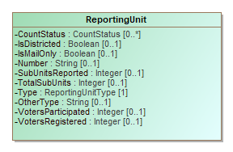

For defining a geopolitical unit such as state, county, township, precinct, etc., using the [ReportingUnitType](#17_0_2_4_f71035d_1431607637366_785815_2242) enumeration. It inherits the attributes of [GpUnit](#17_0_2_4_78e0236_1389366233346_42391_2380).

This class optionally references [Person](#17_0_5_1_43401a7_1400623980732_100904_3567) to associate one or more individuals, e.g., authorities, for the reporting unit. It also includes [ContactInformation](#17_0_5_1_43401a7_1400624327407_326048_3637) to provide contact addresses for the reporting unit, such as an address of a vote center.

[Election](#17_0_2_4_f71035d_1426101822599_430942_2209) references this class so as to identify the geographical scope of the election. In this case, the [GpUnit](#17_0_2_4_78e0236_1389366233346_42391_2380) element defined for the scope of the election may include [ElectionAdministration](#18_0_2_6340208_1441311877439_710008_4433) to include election authority-related information.

The [Type](#17_0_2_4_78e0236_1389713376966_77071_2393) attribute uses the [ReportingUnitType](#17_0_2_4_f71035d_1431607637366_785815_2242) enumeration to specify the type of geopolitical geography being defined. [ReportingUnitType](#17_0_2_4_f71035d_1431607637366_785815_2242) contains the most common types of geographies, e.g., state, county, precinct, and so forth. If the reporting unit type is not listed in enumeration [ReportingUnitType](#17_0_2_4_f71035d_1431607637366_785815_2242), use other and include the reporting unit type (that is not listed in the enumeration) in [OtherType](#17_0_2_4_f71035d_1426007519161_685921_2510).

The [IsDistricted](#17_0_2_4_f71035d_1441207733430_83517_2240) boolean can be used in a number of ways. It is not strictly necessary, as it is possible to identify districts by their [Type](#17_0_2_4_78e0236_1389713376966_77071_2393) attribute or by examining the [Contest](#17_0_2_4_78e0236_1389366251994_876831_2400) instance’s [ElectionDistrict](#17_0_2_4_78e0236_1389366667508_703141_2753) reference, which links to the election district associated with the contest. However, if a district is defined but is not linked from a contest, or if the type of district is not listed in the [ReportingUnitType](#17_0_2_4_f71035d_1431607637366_785815_2242) enumeration and therefore [OtherType](#17_0_2_4_f71035d_1426007519161_685921_2510) is used, then [IsDistricted](#17_0_2_4_f71035d_1441207733430_83517_2240) is necessary to identify the [GpUnit](#17_0_2_4_78e0236_1389366233346_42391_2380) as a district. The [IsDistricted](#17_0_2_4_f71035d_1441207733430_83517_2240) boolean can also be used to signify that a [GpUnit](#17_0_2_4_78e0236_1389366233346_42391_2380) defined as a jurisdiction, e.g., a county, is also used as a district for, e.g., county-wide contests.

Attribute | Multiplicity | Type | Attribute Description
--------- | ------------ | ---- | ---------------------
`{Authority}`|0..*|`Person`|A link to one or more [Person](#17_0_5_1_43401a7_1400623980732_100904_3567) instances describing an authority responsible for the reporting unit.
`{ContactInformation}`|0..1|`ContactInformation`|For associating contact information with the reporting unit.
`CountStatus`|0..*|`CountStatus`|For providing various counting status on types of ballots or other items.
`{ElectionAdministration}`|0..1|`ElectionAdministration`|For use when the reporting unit serves as the authority in the election.
`IsDistricted`|0..1|`Boolean`|Boolean to indicate whether the reporting unit is a district; assumed to be “false” if not present.
`IsMailOnly`|0..1|`Boolean`|Boolean to indicate whether the reporting unit handles only mail-in or absentee ballot elections, assumed to be “false” if not present.
`Number`|0..1|`String`|A number associated with the reporting unit; for compatibility with VIP.
`{PartyRegistration}`|0..*|`PartyRegistration`|For associating a count of registered voters per party with the geopolitical unit.
`{SpatialDimension}`|0..1|`SpatialDimension`|For describing the reporting unit’s spatial extent (a polygon that shows the related area).
`SubUnitsReported`|0..1|`Integer`|Number of associated subunits such as precincts that have completed reporting.
`TotalSubUnits`|0..1|`Integer`|Total number of associated subunits such as precincts.
`Type`|1|`ReportingUnitType`|Enumerated type of reporting unit, e.g., state, county, district, precinct, etc.
`OtherType`|0..1|`String`|For use when [ReportingUnitType](#17_0_2_4_78e0236_1389713376966_77071_2393) value is other.
`VotersParticipated`|0..1|`Integer`|Number of voters who have participated in the election, i.e., shown up at the polls, including those who did not cast ballots.
`VotersRegistered`|0..1|`Integer`|Number of registered voters residing within the boundaries of the geopolitical unit.

### *The **RetentionContest** Class*

For judicial retention or other types of retention contests. Retention contests can be treated essentially as ballot measure contests, however this element differs from
[BallotMeasureContest](#17_0_2_4_78e0236_1389366932057_929676_2783) in that it can include a reference to a candidate or the associated office.

This element uses [BallotMeasureContest](#17_0_2_4_78e0236_1389366932057_929676_2783) as a superclass. Therefore, it inherits the attributes of [Contest](#17_0_2_4_78e0236_1389366251994_876831_2400) as well as [BallotMeasureContest](#17_0_2_4_78e0236_1389366932057_929676_2783).

Attribute | Multiplicity | Type | Attribute Description
--------- | ------------ | ---- | ---------------------
`{Candidate}`|1|`Candidate`|Link to a [Candidate](#17_0_2_4_78e0236_1389366272694_544359_2440) instance. For associating a candidate with the retention contest.
`{Office}`|0..1|`Office`|Link to an [Office](#17_0_5_1_43401a7_1400623830572_164081_3518) instance. For associating an office description with the retention contest.

### *The **Schedule** Class*

For defining a schedule associated with a particular election office or location. [ContactInformation](#17_0_5_1_43401a7_1400624327407_326048_3637) includes Schedule.

Attribute | Multiplicity | Type | Attribute Description
--------- | ------------ | ---- | ---------------------
`{Hours}`|0..*|`Hours`|For specifying a range of hours for a schedule.
`IsOnlyByAppointment`|0..1|`Boolean`|If an appointment is only by appointment; assumed to be “no” if not present.
`IsOrByAppointment`|0..1|`Boolean`|If an appointment can by appointment presumably as desired; assumed to be “no” if not present.
`IsSubjectToChange`|0..1|`Boolean`|If an appointment may be subject to change; assumed to be “no” if not present.
`Label`|0..1|`String`|For use as needed and compatibility with the VIP schema.
`StartDate`|0..1|`date`|For the starting date of the schedule.
`EndDate`|0..1|`date`|For the ending date of the schedule.

### *The **ShortString** Class*

For defining a 32-character annotation, used with character strings in [AnnotatedString](#18_0_2_6340208_1497553224568_429892_4565).

Attribute | Multiplicity | Type | Attribute Description
--------- | ------------ | ---- | ---------------------
`maxLength`||`Integer`|The maximum allowed length of a ShortString.

### *The **SpatialDimension** Class*

For defining the spatial layout of a [GpUnit](#17_0_2_4_78e0236_1389366233346_42391_2380), e.g., a map or a spatial extent (a polygon that shows the related area) for various purposes, including to visualize election results, to understand the composition of districts, or to determine whether [GpUnit](#17_0_2_4_78e0236_1389366233346_42391_2380) instances are properly related. [GpUnit](#17_0_2_4_78e0236_1389366233346_42391_2380) includes SpatialDimension.

Attribute | Multiplicity | Type | Attribute Description
--------- | ------------ | ---- | ---------------------
`MapUri`|0..*|`AnnotatedUri`|Typically a URI to a map of the [GpUnit](#17_0_2_4_78e0236_1389366233346_42391_2380).
`{SpatialExtent}`|0..1|`SpatialExtent`|For associating a [GpUnit](#17_0_2_4_78e0236_1389366233346_42391_2380) element’s spatial extent information.

### *The **SpatialExtent** Class*

[SpatialDimension](#17_0_2_4_f71035d_1407165065674_39189_2188) includes SpatialExtent for defining a [GpUnit](#17_0_2_4_78e0236_1389366233346_42391_2380) instance’s spatial extent data and the format used for the spatial extent.

Attribute | Multiplicity | Type | Attribute Description
--------- | ------------ | ---- | ---------------------
`Coordinates`|1|`RichText`|The data coordinates constituting the spatial extent.
`Format`|1|`GeoSpatialFormat`|Enumerated type for the format used, e.g., gml, kml, wkt, etc.

### *The **Term** Class*

For describing information about an office term. [Term](#17_0_2_4_f71035d_1428489072598_282236_2217) is included by [Office](#17_0_5_1_43401a7_1400623830572_164081_3518).

Attribute | Multiplicity | Type | Attribute Description
--------- | ------------ | ---- | ---------------------
`Label`|0..1|`String`|For use as needed and compatibility with the VIP schema.
`StartDate`|0..1|`date`|Start date for the current term of the office.
`EndDate`|0..1|`date`|End date for the current term of the office.
`Type`|0..1|`OfficeTermType`|Enumerated type of term, e.g., full-term, unexpired-term, etc.

### *The **TimeWithZone** Class*

Restricts time to require inclusion of time zone information and excludes fractional seconds

Attribute | Multiplicity | Type | Attribute Description
--------- | ------------ | ---- | ---------------------
`pattern`||`String`|Pattern used for indicating the time with the accompanying time zone.

### *The **VoteCounts** Class*

For reporting on vote counts for contest selections in a contest. VoteCounts includes [Counts](#17_0_2_4_78e0236_1389367291663_284973_2835) as an extension base and therefore inherits the elements from [Counts](#17_0_2_4_78e0236_1389367291663_284973_2835), but it is included directly by [ContestSelection](#17_0_2_4_78e0236_1389372124445_11077_2906).

Attribute | Multiplicity | Type | Attribute Description
--------- | ------------ | ---- | ---------------------
`Count`|1|`double`|Count of contest votes cast; can include a factional component in special cases.
